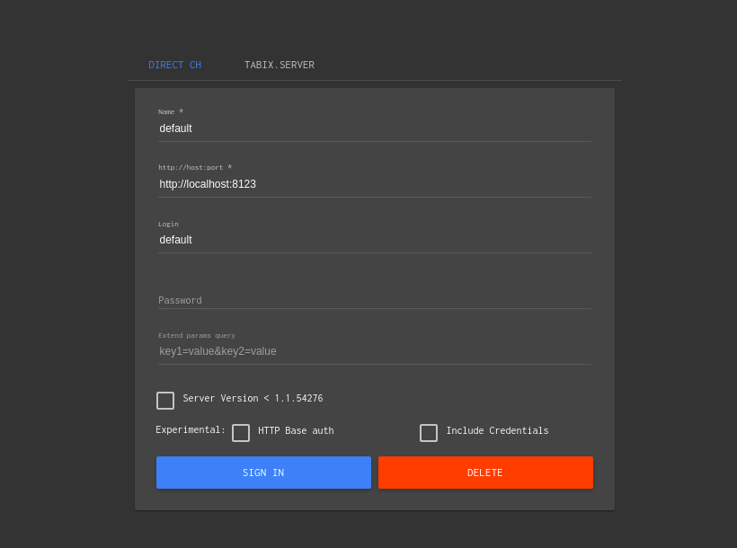

## clickhouse 数据库

用于联机分析的列式数据库管理系统，即数据库中的数据是按列存储的，一列的数据被物理的存储到一起。该数据库的关键特征
  
- 大多数是读请求
- 数据总是以相当大的数据（1000rows）进行读写
- 不修改已经添加的数据
- 每次查询都从数据库中读取大量的行，同时又仅需要少量的列
- 宽表，即每个表包含着大量的列
- 较少的查询
- 对于简单查询，允许延迟大约50毫秒
- 列中的数据相对较少，数字和短字符串
- 处理单个查询时需要高的吞吐量
- 事务不是必须的
- 对数据的一致性要求比较低
- 每一个查询除了一个大表之外都比较小
- 查询结果明显小于源数据，换句话说，数据被过滤或者聚合后能够被盛放在单台服务器的内存中

### 安装

  - ubuntu下安装比较简单：添加dep源，直接apt-get安装
  - 服务启动：sudo service clickhouse-server start
  - 使用clickhouse-client直接连接到服务
  - 服务关闭：sudo service clickhouse-server stop
  - 默认情况下是以localhost:9000服务建立连接，客户端也可以用于连接远程服务

### 界面化工具

  -  tabix工具，github连接：https://github.com/tabixio/tabix
  -  安装：源码编译或者Docker安装
  -  使用docker安装镜像直接运行：`docker run -d -p 8080:80 spoonest/clickhouse-tabix-web-client`
  -  在浏览器上直接访问：`localhost:8080 即可`
  -  登录用户名为default，地址为：http://localhost:8123 密码为空
  -  登录的结果显示如下所示：