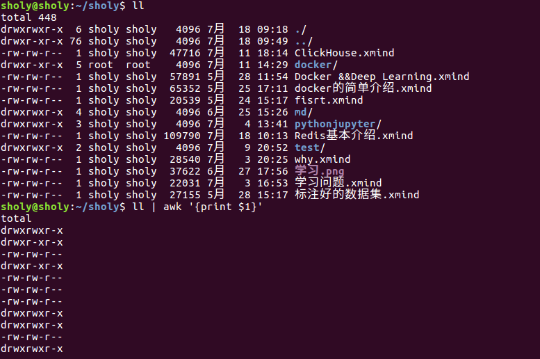

# awk命令详解

## 简介

awk是一个强大的文本分析工具，相对于grep的查找，sed的编辑，awk在其对数据分析并生成报告时，显得尤为强大。简单来说就是awk把文件逐行的读入，以空格为默认分隔符将每行切片，切开的部分再进行各种分析处理。awk有三个不同的版本：awk、nawk、和gawk，一般都是指的gawk。

## 使用方法

```shell
awk '{pattern+action}' {filename}
```

尽管操作可能比较复杂，但是语法基本就是这样。其中pattern表示在数据中查找的内容，action表示在找到匹配内容时所执行的一系列的操作。pattern就是要表示的正则表达式，用斜杠括起来。awk语言的最近本功能就是在文件或者字符串中基于指定规则浏览和抽取信息，awk抽取信息后，才能进行其他的文本操作。完整的awk脚本通常用来格式化文件中的信息。通常，awk是以恩建的一行为处理单位的，awk每接收一行，然后执行相应的命令，来处理文本。

## 调用awk

有三种方式调用awk命令

1. 命令行方式

   ```shell
   awk [-F field-separator] 'commands' input-files
   ```

   其中，commands是真正的awk命令，[-F域分隔符]是可选的， input-files是待处理的文件。

2. shell脚本的方式

   将所有的awk命令插入一个文件，并使awk程序执行，然后awk命令解释器作为脚本的首行，一遍通过键入脚本名称在调用

3. 将所有的awk命令插入一个单独的文件，然后调用

## 操作示例

1. 操作示例如下：

   

   如上图所示，awk的工作流程为：读入有换行符分割的一条记录，然后将记录按照指定的域分隔符划分域，填充域。其中$0表示所有域，$1表示第一个域，也就是第一列。

   如`awk -F ':' {print($1)}` 则表示指定每一行的分隔符为冒号。

2.  awk内置变量,

   awk有许多的内置变量用来设置环境信息，这些变量可以被改变，下面给出了最常用的一些变量。

   ```shell
   ARGC               #命令行参数个数
   ARGV               #命令行参数排列
   ENVIRON            #支持队列中系统环境变量的使用
   FILENAME           #awk浏览的文件名
   FNR                #浏览文件的记录数
   FS                 #设置输入域分隔符，等价于命令行 -F选项
   NF                 #浏览记录的域的个数
   NR                 #已读的记录数
   OFS                #输出域分隔符
   ORS                #输出记录分隔符
   RS                 #控制记录分隔符
   ```

3. 条件语句示例

   1. 正则表达式

      ```shell
      awk -F ':' '/usr/ {print $1}' demo.txt
      ```

      值输出包含/user的行

   2. if语句

      ```shell
      awk -F ':' '{if ($1 > "m") print $1}' demo.txt
      awk -F ':' '{if ($1 > "m") print $1; else print "---"}' demo.txt
      ```

      可以指定if语句，也可以指定else语句。


