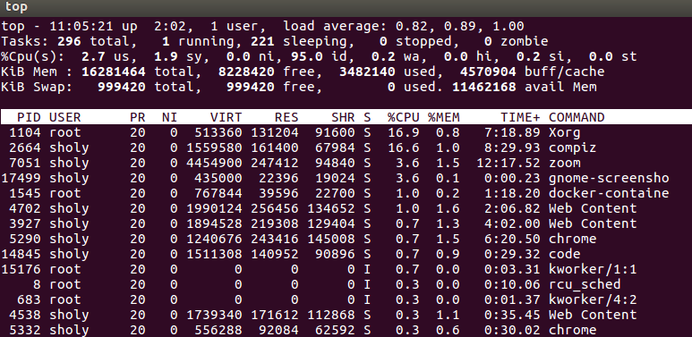
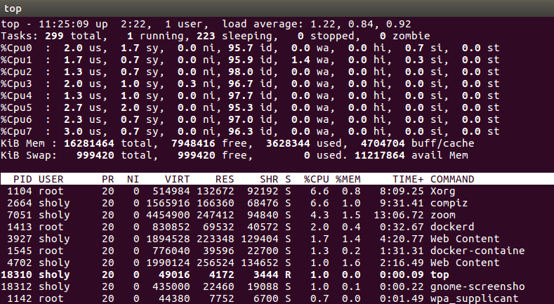

## top命令详解

top命令是linux下常用的性能分析工具，能够实时显示各个进程资源的占用情况，类似Windows下的任务管理器。并且，top是一个动态的显示过程，使用top命令之后将独占前台，直到用户自己手动终止掉。top命令提供了实时的对系统处理器的状态监视，将显示系统中CPU的任务列表以及资源占用。

1. 命令格式
   `top [参数]`
2. 命令功能

    显示当前系统正在执行的进程相关的信息，包括进程ID、内存占用率、CPU占用率等

3. 命令参数

    - -b 批处理
    - -c 显示完整的命令
    - -I 忽略失效过程
    - -s 保密模式
    - -S 累积模式
    - -i [时间] 设置间隔时间
    - -u [用户名] 指定用户名
    - -p [进程号] 指定进程
    - -n [循环次数] 循环显示的次数
  
4. 使用的实例
   1. 显示进程信息
   - 实例如下
    

   - 具体说明
    
    前面是统计信息，具体的含义如下所示：
    - 第一行：当前系统时间，系统已经运行的时间，有几个用户登录使用，load average分别是1/5/15分钟的系统负载情况
    - 第二行： 任务数量，总数和不同状态的数量
    - 第三行：cpu的状态信息，用户空间、内核空间、改变过优先级的进程占用CPU占比、空闲CPU、IO等待占用CPU、硬中断、软中断等的CPU占比。
    - 第四行：内存状态：CPU内存总量，已经使用，空闲数量、缓存的内存量。
    - 第五行：swap交换分区的信息，
    - 第六行：空行
    - 第七行：各进程的状态监控，项目列信息说明：

        - PID：进程ID
        - USER：进程所有者
        - PR：进程优先级 
        - NI：nice值，负值表示高优先级，正值表示低优先级
        - VIRT：进程使用的虚拟内存总量
        - RES：进程使用的、未被换出的物理内存大小
        - SHR：共享内存大小，单位kb
        - s：进程状态
        - %CPU：上次更新到现在的CPU时间占比
        - %MEM：进程使用的物理内存百分比
        - TIME：进程使用的CPU时间总计
        - COMMAND：进程命令

5. 其他使用技巧
   
   1. 在top基本视图中，按数字1查看每个逻辑CPU的使用占比
    
   2. 使用 b （打开和关闭高亮效果）
   3. 进程字段排序：默认是按照CPU占比来排序的，按下X，则改变排序规则
   4. 使用shift + < or shift + >可以调整拍序列
   5. top -c 显示完成command
   6. top -n 3 设置3秒更新一次
   7. top -p pid 显示该进程的状态信息